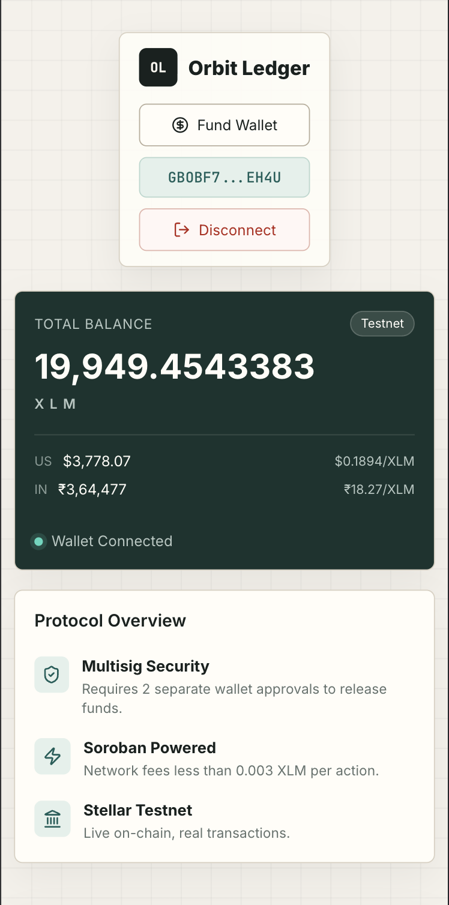

# 💸 Orbit Ledger


[](https://github.com/Kishan0703/Orbit_Ledger/actions)

> On-Chain Payroll Infrastructure powered by Soroban Smart Contracts on Stellar Testnet.

Orbit Ledger is a progressive dApp built across multiple levels of the Stellar Builder Track. It started as a minimal XLM payment interface and has grown level by level into a fully deployed, production-grade multi-signature treasury system. Each level introduced new infrastructure, new smart contract capabilities, and a higher standard of user experience. The result is a complete on-chain payroll application — with wallet integration, Soroban-powered governance, live price feeds, balance caching, comprehensive test coverage, and a public Vercel deployment — all running on Stellar Testnet.

## 🚀 Belt Progression

| Badge | Status | Documentation |
|---|---|---|
| ⚪ White Belt | ✅ Completed | [Level 1 →](levels-docs/level-1.md) |
| 🟡 Yellow Belt | ✅ Completed | [Level 2 →](levels-docs/level-2.md) |
| 🟠 Orange Belt | ✅ Completed | [Level 3 →](levels-docs/level-3.md) |
| 🟢 Green Belt | ✅ Completed | [Level 4 →](levels-docs/level-4.md) |

---

## ⚪ Level 1 — White Belt

### Overview
Level 1 was the foundation. The goal was to build a working Stellar payment application from scratch — connecting a wallet, reading a live balance from the blockchain, and sending XLM to any valid Stellar address. Everything was built using the Horizon REST API and the Freighter browser wallet extension. This level established the core architecture: React frontend, Stellar SDK for transaction building, Horizon for network communication, and Freighter for signing.

### Features

**Wallet Connection via Freighter**
Freighter is a browser extension wallet for Stellar. Level 1 implemented full connect/disconnect logic using the Freighter API. If the user is not on Testnet, the app surfaces a clear warning.

**Live XLM Balance**
The app fetches the user's XLM balance directly from the Horizon Testnet API using the connected public key.

**XLM Payments**
Users can input a recipient Stellar address and an XLM amount and send a payment in a few clicks. The transaction is built using the Stellar SDK and passed to Freighter for signing.

**Transaction Verification**
After every successful payment, the app generates a direct link to StellarExpert with the transaction hash so users can independently verify the transaction on the blockchain explorer.

[View Full Level 1 Documentation →](levels-docs/level-1.md)

---

## 🟡 Level 2 — Yellow Belt

### Overview
Level 2 introduced smart contract infrastructure and multi-signature governance. A custom Soroban treasury contract was written in Rust, tested, and deployed to Stellar Testnet. The core payroll feature — a three-step on-chain proposal system requiring two independent wallet approvals before funds can be released — was built end to end.

### Soroban Smart Contract
The treasury contract manages payroll proposals with on-chain state and enforces multi-signature rules that cannot be bypassed. The contract exposes three core functions:

| Function | Description |
|---|---|
| `create_proposal(proposer, employees, amounts)` | Creates a new payroll proposal on-chain |
| `approve_proposal(approver, proposal_id)` | Adds an approval signature from a wallet |
| `execute_proposal(executor, proposal_id, token)` | Releases funds after 2 approvals |

**Contract ID:** `CCKR26GKAMQQOQAXYU6SLDAYFQ4V73NSDTXSD2BCQXP6EEMAA7URNJAS`  
🔍 [View on StellarExpert ↗](https://stellar.expert/explorer/testnet/contract/CCKR26GKAMQQOQAXYU6SLDAYFQ4V73NSDTXSD2BCQXP6EEMAA7URNJAS)

### Features

**StellarWalletsKit Integration**
The wallet layer was upgraded from a single Freighter implementation to StellarWalletsKit, providing a unified interface for connecting multiple Stellar wallets — necessary for testing multi-sig.

**3-Step Multi-Sig Payroll Flow**
1. **Create Proposal** — Writes the proposal to the Soroban contract
2. **Approve** — Approvals must come from two distinct wallets
3. **Execute** — Requires 2 on-chain approvals before funds release

[View Full Level 2 Documentation →](levels-docs/level-2.md)

---

## 🟠 Level 3 — Orange Belt

### Overview
Level 3 transforms Orbit Ledger from a working multi-signature dApp into a production-ready application. This stage focused on reliability, user experience, performance optimization, and testing.

### Features

**Structured Loading States**
All async actions (Create, Approve, Execute) now display clear step-based progress messages.

**Balance Caching (30s TTL) & Auto-Refresh**
Balances are cached in memory for 30 seconds to reduce redundant Horizon calls, with silent background refresh.

**Live USD & INR Value Display**
The dashboard shows the current XLM rate, total wallet value in USD, and total wallet value in INR — fetched live from CoinGecko.

**Improved Error Handling**
Smart contract error codes are mapped to clear user-friendly messages: proposal not found, already executed, more approvals required, invalid address, already approved.

**Deployed on Vercel**
Publicly accessible at [https://orbit-ledger-app.vercel.app/](https://orbit-ledger-app.vercel.app/)

[View Full Level 3 Documentation →](levels-docs/level-3.md)

---

## 🟢 Level 4 — Green Belt

### Overview
Level 4 is the final production-ready polish of the application. It introduces advanced Soroban contract patterns with **inter-contract calls**, a **custom SPAY Token**, full **mobile responsiveness**, comprehensive **analytics**, and automated **CI/CD pipelines**. The application is now a complete, scalable, and fully tested Web3 product.

### Advanced Contract Patterns

**Inter-Contract Calls & Custom Token**
A new custom Soroban token contract (SPAY Token) was deployed. The Treasury contract was upgraded to include an inter-contract call: whenever a payroll proposal is executed, the Treasury contract securely invokes the SPAY token's `mint()` function to issue 1 SPAY token to each paid employee automatically — all in a single transaction.

**SPAY Token Contract implements:**
- `mint()` — restricted to Treasury contract address only
- `balance()` — query any wallet's SPAY balance
- `total_supply()` — query total SPAY tokens minted

### Frontend Features

**Advanced Dashboard & Analytics**

| Metric | Description |
|---|---|
| **Total Paid (XLM)** | Sum of all XLM successfully distributed |
| **Total Proposals** | Count of all executed payroll transactions |
| **SPAY Minted** | Total SPAY tokens earned by employees |
| **Active Employees** | Number of unique wallet addresses paid |

**Payroll History & CSV Export**
A comprehensive on-chain execution history table showing who was paid, how much, when, and with clickable StellarExpert transaction hash links. Full data export via 1-click CSV Export.

**CI/CD Pipeline**

[](https://github.com/Kishan0703/Orbit_Ledger/actions)

On every push to `main`, GitHub Actions automatically:
- ✅ Builds the Vite frontend production bundle
- ✅ Runs `cargo test` on the Treasury contract (4 tests)
- ✅ Runs `cargo test` on the SPAY Token contract (5 tests)

**Mobile Responsive Design**
Fully optimized for all screen sizes via CSS media queries — flawless experience on desktop, tablet, and mobile.

### 📸 Level 4:

**Mobile Responsive View:**  
<p align="center">
  
</p>

**CI/CD Pipeline Success:**  
<p align="center">
  
</p>


[View Full Level 4 Documentation →](levels-docs/level-4.md)

---

## 📝 Soroban Contracts

| Contract | ID | Explorer |
|---|---|---|
| **Treasury** | `CCKR26GKAMQQOQAXYU6SLDAYFQ4V73NSDTXSD2BCQXP6EEMAA7URNJAS` | [View ↗](https://stellar.expert/explorer/testnet/contract/CCKR26GKAMQQOQAXYU6SLDAYFQ4V73NSDTXSD2BCQXP6EEMAA7URNJAS) |
| **SPAY Token** | `CBJBY4ER5AXT6FC7M5V7PMPANDTBVELP6AOBEKXQHZPEHDPL4ZG3L547` | [View ↗](https://stellar.expert/explorer/testnet/contract/CBJBY4ER5AXT6FC7M5V7PMPANDTBVELP6AOBEKXQHZPEHDPL4ZG3L547) |

---

## 🌐 Experience the App

<p align="center">
  <a href="https://orbit-ledger-app.vercel.app/">
    
  </a>
  &nbsp;
  <a href="https://drive.google.com/file/d/1g_jVt3vx0t-tRuzgm6CmuiPyOul5e0JI/view?usp=drivesdk">
    
  </a>
</p>

Orbit Ledger is deployed on Vercel for quick review, and the short demo video walks through the wallet connection, treasury workflow, approval flow, and final transaction proof.

---

## ⚙️ Setup & Installation

### Prerequisites

- [Node.js](https://nodejs.org/) v18+
- [Freighter Wallet](https://www.freighter.app/) browser extension
- Freighter set to **Testnet**
- Testnet XLM — fund via [Stellar Laboratory Faucet](https://laboratory.stellar.org/#account-creator?network=test)

### Run Locally
```bash
# Clone the repository
git clone https://github.com/Kishan0703/Orbit_Ledger.git
cd Orbit_Ledger

# Install dependencies
npm install

# Start development server
npm run dev
```

---

## 🛠 Tech Stack

| Layer | Technology |
|---|---|
| Frontend | React + Vite |
| Smart Contracts | Rust + Soroban SDK |
| Wallet | Freighter via Stellar Wallets Kit |
| Network | Stellar Testnet |
| Price Feed | CoinGecko API |
| CI/CD | GitHub Actions |
| Hosting | Vercel |

---

<p align="center">Built with 🤍 for the RiseIn Stellar Journey to Mastery 2026</p>
<p align="center">⚪ White → 🟡 Yellow → 🟠 Orange → 🟢 Green Belt Complete</p>
