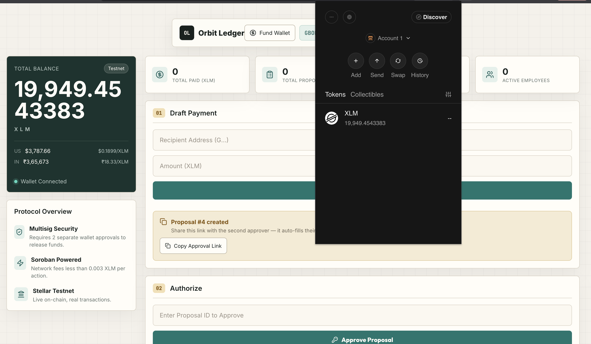
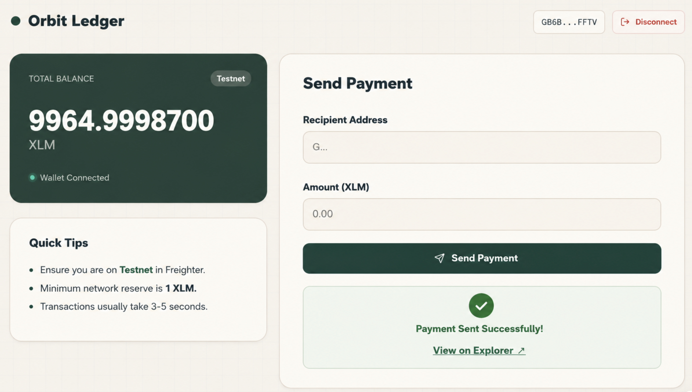
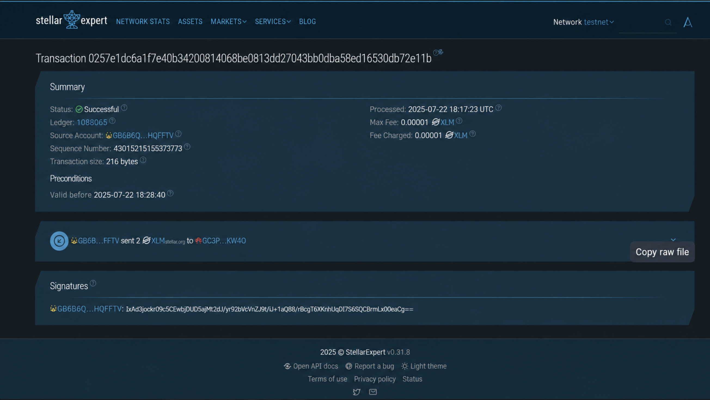

# Orbit Ledger


Orbit Ledger is a clean Stellar Testnet payment dApp for connecting a Freighter wallet, checking XLM balance, sending test payments, and verifying transactions on StellarExpert.

Built for the **Stellar White Belt (Level 1)** challenge in the RiseIn Stellar Journey to Mastery Program 2026.

---

## Preview

| Wallet connected | Live balance |
| --- | --- |
|  |  |

| Payment flow | Successful transaction |
| --- | --- |
|  |  |

| On-chain confirmation |
| --- |
|  |

---

## What It Does

- Connects and disconnects a Freighter wallet
- Fetches the connected account balance from Stellar Horizon Testnet
- Sends XLM to any valid Stellar public address
- Signs transactions securely through Freighter
- Links each successful payment to StellarExpert for verification
- Handles common wallet, address, amount, and network errors

---

## Tech Stack

| Layer | Technology |
| --- | --- |
| Frontend | React.js with Vite |
| Styling | CSS |
| Stellar SDK | `@stellar/stellar-sdk` |
| Wallet | `@stellar/freighter-api` |
| Network | Stellar Testnet |

The app talks directly to `https://horizon-testnet.stellar.org` and does not require a backend.

---

## Quick Start

### Prerequisites

- [Node.js](https://nodejs.org/) v18 or newer
- [Freighter Wallet](https://www.freighter.app/) browser extension
- Testnet XLM from the [Stellar Laboratory Faucet](https://laboratory.stellar.org/#account-creator?network=test)

### Run Locally

```bash
git clone https://github.com/yashannadate/orbit-ledger-whitebelt.git
cd orbit-ledger-whitebelt
npm install
npm run dev
```

Make sure Freighter is set to **Testnet** before connecting your wallet.

---

## How to Use

1. Open the app and click **Connect Wallet**.
2. Confirm the connection in Freighter.
3. Check the displayed XLM balance.
4. Enter a recipient public key and payment amount.
5. Click **Send Payment** and approve the transaction.
6. Open the explorer link to verify the payment on StellarExpert.

---

## Security Notes

- Private keys never touch the app. Freighter handles transaction signing.
- The app is configured for Stellar Testnet only.
- No user account data is stored in a database.
- Transactions are built client-side and submitted through Horizon.

---

## Acknowledgments

- [Stellar Development Foundation](https://stellar.org/)
- [Freighter](https://www.freighter.app/)
- [RiseIn](https://www.risein.com/)

<p align="center">Built for educational purposes as part of the Stellar Journey to Mastery 2026.</p>
