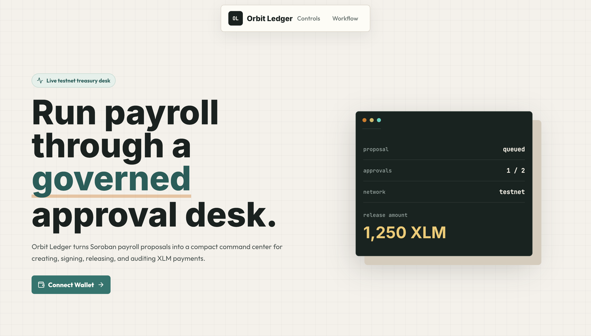
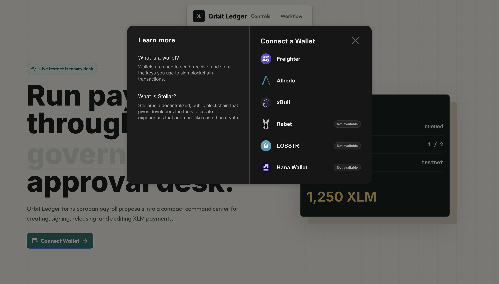
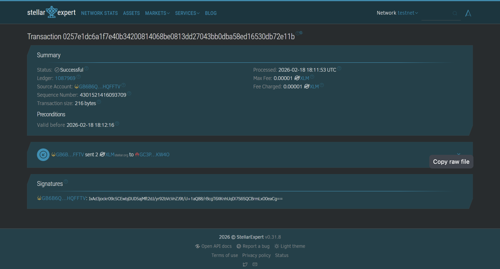

#Orbit Ledger Treasury


Orbit Ledger Treasury is a Level 2 extension of the payment dApp: a small multi-signature payroll treasury where funds are released only after independent wallet approvals.

Built for the **Stellar Yellow Belt (Level 2)** challenge in the RiseIn Stellar Journey to Mastery Program 2026.

---

## Overview

This version moves beyond a single payment screen and introduces a Soroban-backed approval flow. A user can create a payment proposal, a second wallet can approve it, and the treasury can execute the release once the contract has enough approvals.

| Capability | Implementation |
| --- | --- |
| Wallet access | StellarWalletsKit with Freighter on Testnet |
| Treasury logic | Custom Rust Soroban smart contract |
| Approval policy | 2 independent approvals before execution |
| Payment flow | Create proposal, approve proposal, release funds |
| Feedback | Pending, success, error, and explorer-link states |
| Resilience | Handles wallet rejection, network failures, and contract errors |

---

## Contract

| Item | Value |
| --- | --- |
| Contract address | `CCKR26GKAMQQOQAXYU6SLDAYFQ4V73NSDTXSD2BCQXP6EEMAA7URNJAS` |
| Network | Stellar Testnet |
| Explorer | [Open contract on StellarExpert](https://stellar.expert/explorer/testnet/contract/CCKR26GKAMQQOQAXYU6SLDAYFQ4V73NSDTXSD2BCQXP6EEMAA7URNJAS) |

---

## Verified Transaction

Transaction hash:

```text
66c2f2987c23c9da76c245db86b1551ffb8ced5e27bb74d20bf2c0ad0fbfeddf
```

[View transaction on StellarExpert](https://stellar.expert/explorer/testnet/tx/66c2f2987c23c9da76c245db86b1551ffb8ced5e27bb74d20bf2c0ad0fbfeddf)

---

## Screenshots

| Connect wallet | Choose payment details |
| --- | --- |
|  |  |

| Proposal created | Transaction verified |
| --- | --- |
|  |  |

---

## User Flow

1. Connect Wallet 1 and confirm Freighter is on Stellar Testnet.
2. Enter the recipient public key and XLM amount.
3. Submit the payment proposal and save the returned proposal ID.
4. Switch to Wallet 2 and approve the same proposal ID.
5. Execute the proposal after the second approval.
6. Open the StellarExpert link to confirm the on-chain transaction.

---

## Error Handling

| Case | User-facing response |
| --- | --- |
| Wallet rejection | `Transaction rejected in wallet.` |
| Network broadcast failure | `Network broadcast failed. Please try again.` |
| Proposal not found | `Proposal not found. Please check the ID.` |
| Already executed | `This proposal has already been executed.` |
| Already approved | `You have already approved this proposal.` |
| Missing approvals | `More approvals needed before execution.` |

---

## Security Notes

- Private keys never enter the app; Freighter signs externally.
- The treasury rule is enforced in the Soroban contract, not only in the UI.
- The app talks directly to Stellar Testnet without a custom backend.
- Account changes clear form state to avoid submitting stale wallet data.
- The deployment and explorer links are Testnet-only.

---

<p align="center">Yellow Belt complete · Stellar Builder Track 2026</p>
